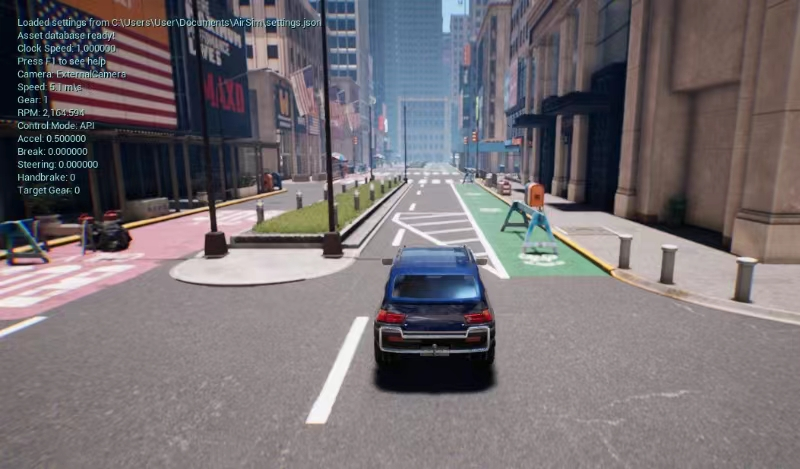

# AirSim_UE
***Here is one of the simplest ways to get RGB images and depth maps from Unreal Engine using AirSim.***

    
    

In this method, you can get most of the information including lidar and GroundTruth trajectory from rosbag and use CVMode to get high FPS(whatever you want) images and depth maps.

## 1. Install Unreal Engine and compile AirSim for it
Please refer to https://www.unrealengine.com/en-US/download and https://microsoft.github.io/AirSim/ to install them.

For beginners, refer to https://zhuanlan.zhihu.com/p/619214564, which is a great Chinese tutorial.

Then you need to find a good scene for your Unreal Engine.

**Tips:** 

Install it on Linux is not recommended because you can't create your Unreal Project there, it means you still need to use Windows to create the project and transfer it to the Linux system.

Install it on a remote server is not recommended because any remote image transmission experience rendered through GPU is not good as far as I know.

## 2. Install a version of WSL on your Windows and install ROS
WSL is the most convenient way to get information through ROS in Windows.

Refer to https://learn.microsoft.com/en-us/windows/wsl/install to install WSL with Ubuntu on Windows.

Refer to http://wiki.ros.org/ROS/Installation to install ROS in Ubuntu.

Then, remember to install the same version of AirSim in Ubuntu

## 3. Setup AirSim

**Now you have all the requirements installed, you need to set up the AirSim config file**

**GT.json** in this repo is used to record Lidar or GroundTruth Odom to rosbag.

**CVMode.json** in this repo is used to record images and depth maps.

**Here are the steps:**

1. Copy GT.json to "C:\Users\User\Documents\AirSim" and rename it to "settings.json".

2. Set the GameMode in Unreal Engine to "AirSimGameMode" and run.

3. Run this in WSL. If failed, check your AirSim installation.
```console
roslaunch airsim_ros_pkgs airsim_node.launch
```

4. Now you should get this in WSL while running rostopic list:
```console
/airsim_node/drone_1/altimeter/barometer
/airsim_node/drone_1/environment
/airsim_node/drone_1/global_gps
/airsim_node/drone_1/gps/gps
/airsim_node/drone_1/imu/imu
/airsim_node/drone_1/magnetometer/magnetometer
/airsim_node/drone_1/odom_local_ned
/airsim_node/drone_1/vel_cmd_body_frame
/airsim_node/drone_1/vel_cmd_world_frame
/airsim_node/gimbal_angle_euler_cmd
/airsim_node/gimbal_angle_quat_cmd
/airsim_node/origin_geo_point
/rosout
/rosout_agg
/tf
/tf_static
```

## 4. Record your odom and other data to a rosbag

1.Using python API to control your drone or vehicle, "simple.py" and "fly_circle.py" in the folder are two examples.

2.Run in WSL to record the trajectory:
```console
rosbag record -O bag_name.bag /airsim_node/drone_1/odom_local_ned
```

## 5. Setup AirSim to CV Mode

**GT.json** in this repo is used to record Lidar or GroundTruth Odom to rosbag.

**CVMode.json** in this repo is used to record images and depth maps.

1. Rename current "settings.json" to "GT.json"
  
2. Copy CVMode.json to "C:\Users\User\Documents\AirSim" and rename it to "settings.json"

3. Rerun Unreal Engine, now airsim is running in CVMode

## 6. Using a Python script to get the images and depth maps you want
Run the script get_img_using_rosbag.py with config args. Here is an example:

```console
python3 get_img_using_rosbag.py --bag bag_name.bag --dir '/mnt/d/mydata'
```

## 7. Extract other information from rosbag
Run the script extract_data_from_rosbag.py with config args. Here is an example:

```console
python3 extract_data_from_rosbag.py --bag bag_name.bag --out_file ./my_GT.txt
```

## Contact me

yuantao@xauat.edu.cn


